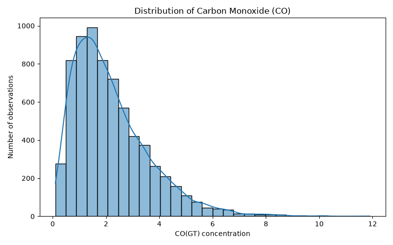
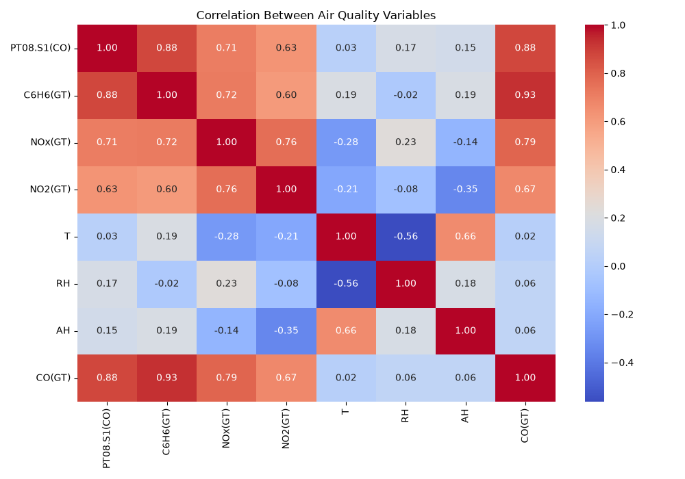
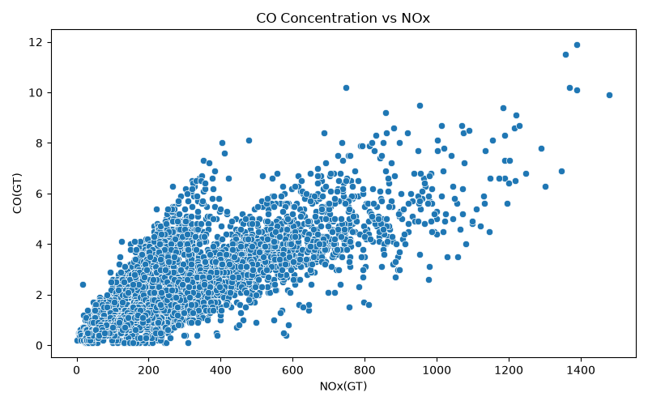
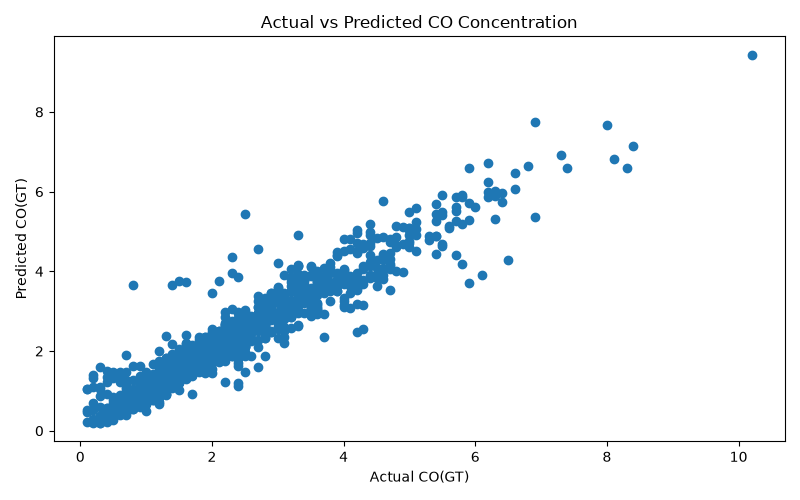
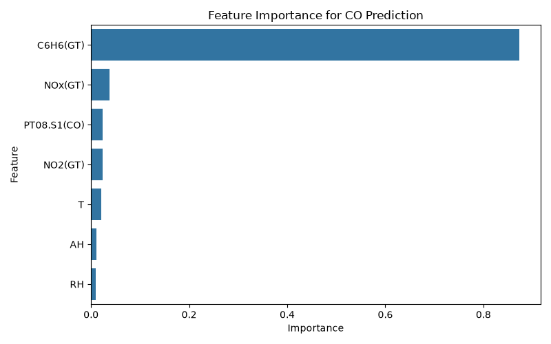

# Air Quality Prediction Using Python

A beginner-level data science project using Python to analyze air quality data and predict carbon monoxide (CO) concentration using machine learning.

## Project Overview

This project uses the UCI Air Quality dataset to:

* Clean and prepare real-world air quality data
* Analyze the distribution of CO concentration
* Study relationships between air-quality variables
* Build a Linear Regression model to predict CO concentration
* Evaluate model performance using MAE, RMSE and R²
* Analyze feature importance using Random Forest

## Technologies Used

* Python
* Pandas
* NumPy
* Matplotlib
* Seaborn
* Scikit-learn
* Jupyter/Python environment

## Dataset

The project uses the UCI Air Quality dataset containing measurements of pollutants and environmental conditions recorded over time.

The dataset contains variables including:

* CO concentration
* NOx
* NO2
* Benzene (C6H6)
* Temperature
* Relative Humidity
* Absolute Humidity
* Sensor measurements

The value `-200` was treated as a missing-value indicator and replaced with `NaN`.

## Data Cleaning

The dataset originally contained 9,357 observations.

After removing rows with missing values in the selected variables, the final dataset contained 6,941 observations.

The target variable was:

`CO(GT)`

The prediction features were:

* `PT08.S1(CO)`
* `C6H6(GT)`
* `NOx(GT)`
* `NO2(GT)`
* `T`
* `RH`
* `AH`

## Visualizations







## Machine Learning

A Linear Regression model was trained using an 80/20 train-test split.

### Results

| **Metric** | **Result** |
| ---------- | ---------- |
| MAE | 0.2655 |
| RMSE | 0.4067 |
| R² Score | 0.9124 |

The R² score indicates that the model explained approximately 91.2% of the variation in CO concentration in the test set.

## Feature Importance

A Random Forest model was also used to examine the relative importance of the input features.



The model identified `C6H6(GT)` as the most important feature for its predictions.

Feature importance describes how much a feature contributed to the Random Forest's predictive decisions. It does not mean that the feature directly causes CO concentration.

## Limitations

- The project uses a relatively simple machine-learning approach.
- Missing data reduced the number of usable observations.
- The model does not include every variable available in the original dataset.
- Feature importance should not be interpreted as causation.
- Model performance may differ on other datasets or future observations.

## Learning Outcome

This project helped me practice:

- Python programming
- Data cleaning
- Exploratory data analysis
- Data visualization
- Linear Regression
- Model evaluation
- Random Forest feature analysis
- Working with a real-world dataset

## Project Structure

```text
Air-Quality-Analysis
├── air_quality_analysis.py
├── images
│   ├── co_distribution.png
│   ├── correlation_heatmap.png
│   ├── co_vs_nox.png
│   ├── actual_vs_predicted.png
│   └── feature_importance.png
└── data
    └── AirQualityUCI.xlsx
